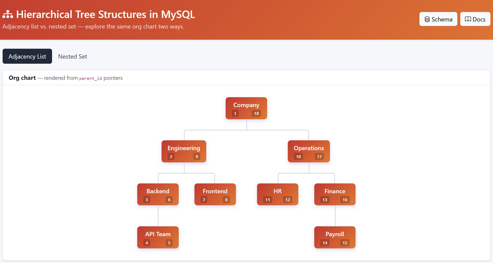

# MySQL Hierarchical Tree Structures

A hands-on guide and interactive playground for storing tree-shaped data in MySQL using two proven models — **Adjacency List** and **Nested Set** — with a company org chart as the running example.

```
Company
├── Engineering
│   ├── Backend → API Team
│   └── Frontend
└── Operations
    ├── HR
    └── Finance → Payroll
```

## Preview



## What's inside

| File | Purpose |
| --- | --- |
| [Organizing-Hierarchical-Tree-Structures-in-MySQL.md](Organizing-Hierarchical-Tree-Structures-in-MySQL.md) | Full article — concepts, queries, trade-offs |
| [schema.sql](schema.sql) | Database schema + seed data (run this first) |
| [schema.html](schema.html) | Browser view of the schema with copy-to-clipboard |
| [index.php](index.php) | Interactive playground (runs queries live) |
| [docs.html](docs.html) | Rendered article in the browser |

## The two models

- **Adjacency List** — each row holds a `parent_id`. Easy writes, recursive reads.
- **Nested Set** — each row holds `lft`/`rgt` boundaries. Fast subtree reads, costly writes.

The article explains when to pick which, with SQL for the common queries (descendants, ancestors, depth, breadcrumbs, headcount roll-ups).

## Quick start (WAMP / XAMPP)

1. Drop this folder into `www/` (e.g. `c:\wamp64\www\mysql-hierarchical-tree-structures`).
2. Import the schema:
   ```bash
   mysql -u root < schema.sql
   ```
   Or open [schema.html](schema.html), copy the SQL, and paste it into phpMyAdmin.
3. Visit `http://localhost/mysql-hierarchical-tree-structures/` in your browser.

The playground connects with WAMP defaults (`root` / no password). Edit the credentials at the top of [index.php](index.php) if yours differ.

## Requirements

- MySQL 8.0+ (for recursive CTEs and `CHECK` constraints)
- PHP 7.4+ with PDO MySQL
- Apache (WAMP, XAMPP, or any LAMP stack)

## License

MIT — use it, fork it, learn from it.
